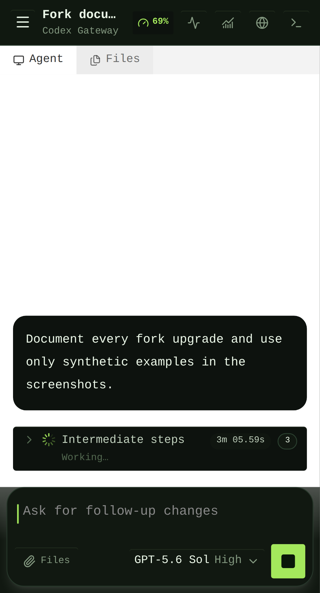
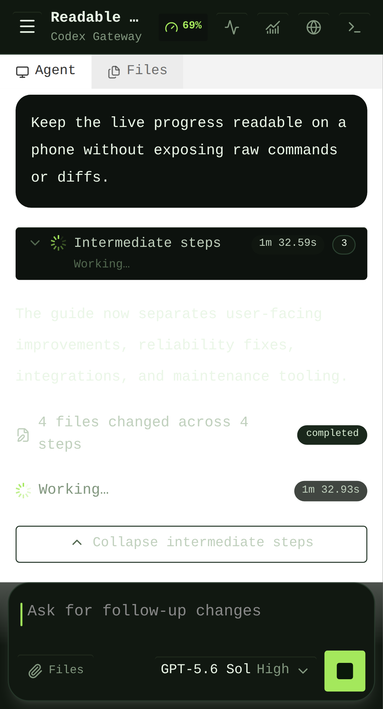
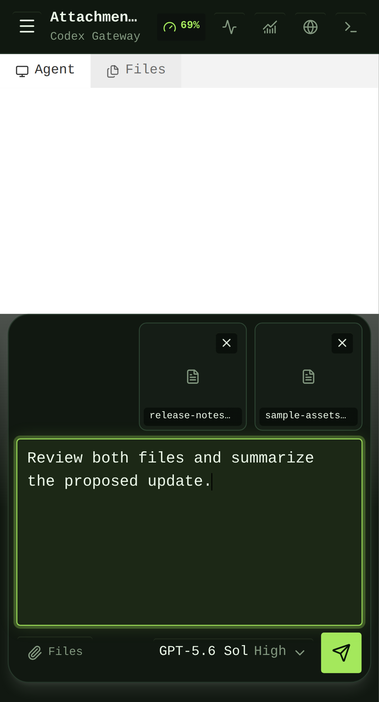
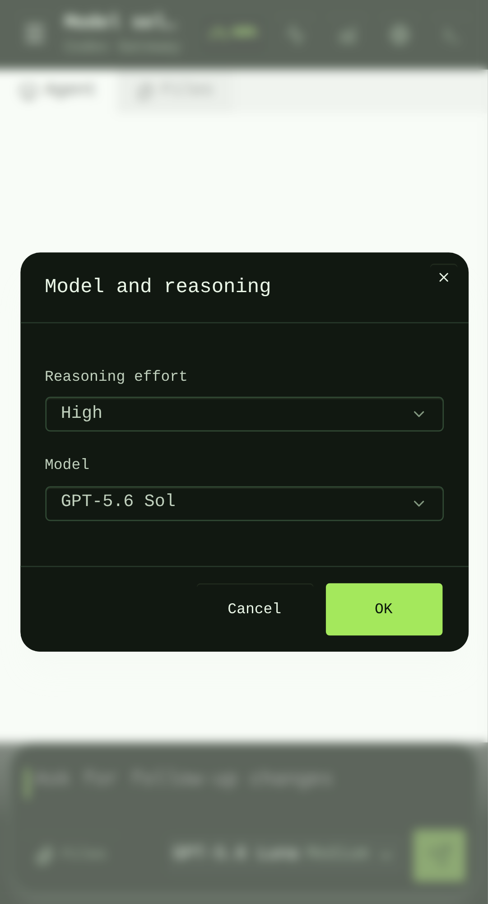

# Codex Gateway Extended

Last reviewed: 2026-09-01<br>
Deployment branch: [`spax/customizations-20260824`](https://github.com/mikespax/codex-gateway-extended/tree/spax/customizations-20260824)<br>
Reviewed application head: [`aad9578`](https://github.com/mikespax/codex-gateway-extended/commit/aad9578)

This is the public inventory and maintenance guide for the deployment-specific
changes in [`mikespax/codex-gateway-extended`](https://github.com/mikespax/codex-gateway-extended).
It describes the fork without publishing credentials, private host details,
customer data, or live production state.

The fork remains a frontend and controller for the official Codex app-server. It
does not replace the Codex runtime, proxy OpenAI inference, or make browser state
the source of truth.

## Screenshots

These screenshots use synthetic E2E data, not production chats or hosts.

<table>
  <tr>
    <td width="50%">
      <a href="assets/spax-customizations/mobile-running-turn.png"></a><br>
      <strong>Running turn</strong><br>
      <sub>Current-request context, compact progress, elapsed work, and the mobile composer.</sub>
    </td>
    <td width="50%">
      <a href="assets/spax-customizations/mobile-expanded-progress.png"></a><br>
      <strong>Expanded progress</strong><br>
      <sub>Narrative status remains visible while repetitive implementation detail is condensed.</sub>
    </td>
  </tr>
  <tr>
    <td width="50%">
      <a href="assets/spax-customizations/mobile-attachments.png"></a><br>
      <strong>Attachments</strong><br>
      <sub>Separate document/archive and media choices on Android.</sub>
    </td>
    <td width="50%">
      <a href="assets/spax-customizations/mobile-model-effort-dialog.png"></a><br>
      <strong>Model and effort</strong><br>
      <sub>Compact selectors with explicit OK and Cancel semantics.</sub>
    </td>
  </tr>
</table>

## At a glance

| Area                     | Fork behavior                                                                       | Status at reviewed head                                      |
| ------------------------ | ----------------------------------------------------------------------------------- | ------------------------------------------------------------ |
| Mobile composer          | Keyboard-aware sizing, multiline Enter, text assistance, explicit send              | Deployed branch                                              |
| Live turns               | Follow-latest behavior, elapsed time, current-request context, steer-aware timeline | Deployed branch                                              |
| Intermediate steps       | Condensed routine activity, hidden raw file diffs, grouped file-change summaries    | Deployed branch                                              |
| Navigation               | Cross-host recents, pinned activity ordering, collapsible Hosts, global New Chat    | Deployed branch                                              |
| Attachments              | Images, documents, Markdown, ZIP archives, Android document picker                  | Deployed branch                                              |
| Notifications            | Firebase Android replies plus desktop completion sound and native browser notifications | Desktop path is opt-in                                      |
| Usage                    | Compact remaining Codex usage indicator in the mobile header                        | Deployed branch                                              |
| Model settings           | Model and reasoning effort are staged and confirmed together                        | Deployed branch                                              |
| Reliability              | Project/host affinity, first-send discovery, stale-client and macOS socket recovery | Deployed branch                                              |
| Supervision              | Explicitly granted, one-thread, read-only transcript/event access                   | Deployed branch                                              |
| Persistent history cache | IndexedDB plus encrypted server snapshot cache                                      | Prepared on `feat/persistent-thread-cache`; not in this head |

## Detailed customization inventory

### 1. Mobile composer and keyboard behavior

- The composer accounts for the visual viewport, software keyboard, and safe-area
  inset so active text and controls remain reachable.
- The focused editor grows inside a keyboard-sized viewport while keeping the
  caret visible in its own scroller.
- Plain **Enter** inserts a newline. Sending remains an explicit toolbar action.
- Spellcheck, autocorrect, autocomplete, and capitalization hints are enabled
  where the browser supports them.
- The empty editor retains a visible caret, and focus styling makes the active
  composer easier to distinguish.
- Attachment previews are compact and removable without clearing the draft.
- Mobile controls expose commonly used agent, file, host-monitor, tmux, and
  terminal actions without requiring the desktop sidebar.

Primary commits: `be9d144`, `a2050d7`, `bd74e47`, `73a079e`, `73ac60d`.

### 2. Long-running turn visibility

- When the reader is near the bottom, streamed output follows automatically.
- Manual reading or touch/momentum scrolling disengages follow-latest behavior
  instead of repeatedly snapping the reader downward.
- Expanded intermediate output can keep following active work.
- Active work shows a spinner and total elapsed time in compact and expanded states.
- A compact latest-request card recalls the user instruction being handled.
- Multiple steers remain represented as user messages in sequence, with their
  relevant intermediate activity separated in the timeline.
- Completed responses expose turn duration and a full-response copy action.

Primary commits: `61a9acd`, `28f307f`, `73a079e`, `7e8caf2`, `8b95391`,
`6199af0`.

### 3. Intermediate-step readability

- Empty Thinking items and repetitive routine tool activity are condensed.
- Useful narrative summaries, waiting states, approvals, failures, and current
  work remain visible.
- Expanded views hide raw per-file diff cards and code-change bodies.
- Consecutive completed file-change events become one aggregate row with total
  file and step counts.
- A collapse control remains available below expanded activity.
- Code blocks in normal messages have a copy action; code is not removed from
  final agent answers.

Primary commits: `61a9acd`, `28f307f`, `1d591dd`, `999dacf`, `8b95391`,
`6199af0`, `825ba94`.

### 4. Sidebar and conversation navigation

- A global **New Chat** action is available without first selecting a project thread.
- Pinned conversations are grouped clearly and reorder when new activity arrives.
- Cross-host recent chats retain project/folder context.
- Hosts can be collapsed or hidden to reduce persistent sidebar space.
- The desktop sidebar has a discoverable resize grip.
- Thread and attachment previews carry context to identify the target before opening.

Primary commits: `a2050d7`, `6ea92d8`, `b559f3b`, `7122cfb`, `04a710e`,
`c3be2b0`, `2dc79a9`.

### 5. Correct host, project, and thread targeting

- Recent-thread entries retain their host/project relationship when the same
  workspace exists on several machines.
- A first send waits for project discovery instead of racing app-server startup.
- A send remains bound to the thread selected at submission time, even if the user
  immediately navigates elsewhere.
- Turn start and steer requests resolve the target project consistently across the
  browser, realtime schema, broker, and app-server open path.

These changes address messages that appear not to stick, land in the wrong
conversation, or fail during immediate post-send navigation.

Primary commits: `c881350`, `211c3c4`, `dcacf20`.

### 6. Attachments beyond images

- The upload path accepts supported general files, including Markdown and ZIP
  archives, within configured count and size limits.
- Android presents a document/archive picker separately from camera/media choices.
- The mobile control is labelled **Files** rather than appearing as an ambiguous plus.
- Archives are transported intact; Gateway does not unpack or execute them.
- Local-only attachment metadata is removed before realtime submission.
- The validator tolerates and strips the legacy composer `id` from already-open
  tabs while rejecting unrelated unknown fields.
- E2E coverage includes a real ZIP upload to the selected remote host and payload
  schema regression cases.

Primary commits: `1036f7c`, `8c4a40a`, `595456e`, `957eee7`, `361df20`,
`32dcf42`.

### 7. Android native notifications and inline reply

The optional Android companion uses Firebase Cloud Messaging data messages rather
than SMS. Eligible completed-turn notifications can be continued from Android's
inline reply field.

Security and routing properties:

- Each device receives scoped credentials rather than the user's Gateway session.
- Firebase registration tokens are encrypted at rest; a one-way hash deduplicates
  registrations without making the token the lookup secret.
- Inline replies are accepted only for a server-recorded delivered notification and
  are bound to its account, host, project, and thread.
- Reply request IDs provide idempotency.
- Completed main-turn notifications may be replyable; structured-input and tmux
  notifications remain view-only.
- Devices can be listed or revoked from authenticated administration routes.
- Mobile browser completion toasts are suppressed when native delivery is
  authoritative; desktop browser notifications and error surfaces remain.
- Firebase service-account material is mounted at runtime and is not committed.

See [Android Firebase companion](android-firebase-companion.md).

Primary commits: `4386d95`, `9c25799`.

### 8. macOS desktop browser notifications

- Desktop browsers can request native macOS Notification Center permission from Settings →
  Notifications without prompting on page load.
- Once enabled, completed main turns (including goal completions) show a native notification when
  the Gateway tab is backgrounded or its window is unfocused. Focused windows retain the in-app
  toast and optional two-note completion chime instead of duplicating the native notification.
- Notification keys are deduplicated in the browser, and the preference is local to that browser.
  Mobile browsers remain on the native Android path and do not receive the desktop sound or browser
  notification.
- The test control in Settings verifies permission and delivery without creating a production turn.

Primary commit: `755530e`.

### 9. Codex usage indicator

- A small mobile-header badge reports the remaining percentage for the active
  Codex rate-limit window.
- The browser requests a summary from Gateway; it does not receive or replay
  provider credentials.
- Missing usage data hides the value rather than inventing a percentage.

Primary commit: `73a079e`.

### 10. Model and reasoning effort confirmation

- Mobile uses separate compact selectors for model and reasoning effort.
- Changes remain provisional while the dialog is open.
- **OK** applies the pair in one settings update.
- **Cancel**, close, and outside-click discard the draft selection.
- The composer shows the active model/effort after the dialog closes.
- Models that advertise Codex service tiers expose them in the same staged dialog. Selecting
  **Fast** sends the app-server `serviceTier: "fast"` value for that model; **Default** leaves
  the app-server's normal tier selection in control.

Primary commits: `184444f`, current service-tier integration.

### 11. Release identity and durable delivery guard

- The public `/api/version` endpoint reports the non-sensitive commit SHA baked into a production
  image and the running Node version, so a browser can be compared with reviewed source.
- `scripts/release-gate.sh` refuses dirty checkouts and `main`/`master`; `--build` tags the image
  with the exact commit SHA after a clean release checkout.
- A GitHub Actions workflow draft is retained locally, but it is not presented as a green gate
  until the repository's pre-existing supervisor-script lint and formatting debt is resolved.
  SSH/RPC E2E remains an explicit release check because it requires the real app-server test
  environment.
- The release identity endpoint and release gate are kept with the source so a clean checkout can
  be built and compared against its exact commit, while unrelated local backups and secrets remain
  outside Git.

Primary files: `Dockerfile`, `docker-compose.yml`, `scripts/release-gate.sh`,
`server/api/version.get.ts`.

### 12. Browser and app-server resilience

- Stale macOS app-server Unix-socket/process combinations can be recovered without
  replacing the user's Codex state directory.
- Legacy service workers are retired so an old cached Gateway shell does not keep
  overriding newer deployments.
- Cache/version behavior makes stale clients refresh after a release.
- Runtime reconnection and thread-open changes preserve official app-server
  ownership of the conversation.

Primary commits: `ae84860`, `97ce85f`.

### 13. Scoped thread supervision

- A supervisor grant targets one immutable account/host/project/thread tuple.
- Its bearer token is stored only as a hash and can expire or be revoked.
- The grant exposes bounded history and an event stream for that thread.
- Grants are permission-scoped. Existing grants remain read-only by default.
- A persistent grant can additionally receive `thread.projectManagement.send`; it remains valid
  until explicitly revoked and can only start a plain-text turn on its immutable thread.
- Project-management sends are rejected while the thread is running, accept no target ID,
  attachments, model, approval, collaboration, settings, interrupt, browser, terminal, or file
  parameters, and use an idempotent client message ID.
- Send auditing stores only the grant ID, client message ID, text hash/length, status, timestamps,
  and resulting turn ID. Message text is not copied into the Gateway database.
- Supervisor credentials cannot use normal Gateway APIs, other threads, settings, interrupts, or
  deletion routes.
- Helper scripts create, inspect, and revoke grants without giving automation a
  general-purpose account credential.

Create an expiring read-only grant with the existing command. To create a persistent grant with
project-management sends, add `--persistent true --allow-send true`. Use
`pnpm supervisor:send --token-file <path> --stdin true` to submit a message without placing it in
the process argument list. Revocation continues to use `pnpm supervisor:revoke`.

This is a narrow coordination boundary, not a general-purpose Gateway account or customer-send
authority.

Primary commit: `fbd79bc`.

## Prepared but not included in the reviewed deployment head

### Persistent thread snapshot cache

Branch: `feat/persistent-thread-cache`<br>
Commit: `1c466ae` (`feat: persist thread snapshot caches`)

The prepared cache work adds:

- An account-scoped IndexedDB thread-view cache in the browser.
- Stale-while-revalidate opening while Gateway refreshes cached history.
- An encrypted SQLite server snapshot cache using the existing encryption boundary.
- Per-account entry limits, per-snapshot size limits, a seven-day TTL, and pruning.
- Rejection of running, stale, corrupt, account-mismatched, or target-mismatched
  snapshots.

It is documented for roadmap clarity, but it is not part of `184444f` and must
not be described as deployed until merged, built, deployed, and verified.

## Security and data boundaries

- The browser talks to Nuxt HTTP APIs and Gateway's realtime WebSocket, never
  directly to SSH hosts or remote Codex app-servers.
- Gateway owns SSH, app-server lifecycle, RPC, encrypted configuration, and event
  fan-out.
- Codex app-server/thread state remains authoritative. Browser and server caches
  are disposable projections.
- No `.env` files, private keys, service-account JSON, device credentials,
  bearer tokens, cookies, production databases, customer data, or local overrides
  belong in Git.
- Public screenshots must use synthetic fixtures and generic labels.
- Android device credentials and supervisor grants are narrow capabilities, not
  substitutes for the main account session.
- Archive uploads are stored and forwarded as files, not executed by Gateway.

## Upstream comparison

The functional comparison below runs through reviewed application commit
`184444f`. It excludes this documentation pull request and later
documentation-only commits.

```text
merge base with origin/main: c69d5da
custom branch head:          184444f
origin/main observed:        b8fc409
functional fork commits:     34
new upstream commits:        6
fork diff:                   128 files, +5,746 / -493 lines
```

These counts are a dated snapshot, not a promise that the repositories will remain
at those exact positions.

## Commit-by-commit index

| Commit    | Purpose                                                                                        |
| --------- | ---------------------------------------------------------------------------------------------- |
| `be9d144` | Preserve the initial Spax layout, composer, upload, navigation, and SSH-command customizations |
| `ae84860` | Recover stale macOS app-server sockets                                                         |
| `a2050d7` | Improve sidebar and attachment previews                                                        |
| `6ea92d8` | Make the sidebar resize grip discoverable                                                      |
| `b559f3b` | Add a global New Chat action                                                                   |
| `7122cfb` | Organize pinned chats and allow Hosts to be hidden                                             |
| `61a9acd` | Compact active intermediate steps                                                              |
| `28f307f` | Put the collapse control below intermediate steps                                              |
| `1d591dd` | Add copy controls to code blocks                                                               |
| `bd74e47` | Keep the empty composer caret visible                                                          |
| `04a710e` | Refresh pinned ordering from live status events                                                |
| `c3be2b0` | Add cross-host recent chats                                                                    |
| `2dc79a9` | Show folder/project context for recent chats                                                   |
| `c881350` | Preserve thread project usability on the correct host                                          |
| `211c3c4` | Wait for project discovery before the first send                                               |
| `73a079e` | Improve mobile progress, usage, copy, notification, and workspace feedback                     |
| `73ac60d` | Improve keyboard-aware mobile composer behavior                                                |
| `7e8caf2` | Follow live output with expanded intermediate steps                                            |
| `97ce85f` | Retire stale Gateway clients and service workers                                               |
| `4386d95` | Add Firebase Android notifications and inline replies                                          |
| `999dacf` | Hide expanded raw code-change details                                                          |
| `8b95391` | Compact repetitive live intermediate activity                                                  |
| `6199af0` | Add running status, latest request, and elapsed time                                           |
| `dcacf20` | Keep a send bound to its target thread                                                         |
| `9c25799` | Suppress duplicate mobile browser completion toasts                                            |
| `1036f7c` | Allow archive attachments in chat                                                              |
| `8c4a40a` | Label the mobile attachment control                                                            |
| `595456e` | Add an Android document/archive picker                                                         |
| `957eee7` | Restore non-image multipart uploads                                                            |
| `361df20` | Sanitize client-only attachment metadata                                                       |
| `825ba94` | Aggregate completed file-change steps                                                          |
| `32dcf42` | Accept and strip legacy attachment IDs                                                         |
| `fbd79bc` | Add scoped read-only single-thread supervision                                                 |
| `184444f` | Confirm model and effort selections together                                                   |

## Test coverage added or extended

- Mobile viewport, keyboard, caret, multiline Enter, spellcheck, model/effort,
  usage, notification, attachment, timeline, touch-scroll, and running-turn cases.
- ZIP upload and realtime attachment-schema regression coverage.
- Thread-target preservation across immediate navigation.
- Intermediate condensation, file-change aggregation, and elapsed-status rendering.
- Firebase notification formatting and Android device/reply boundaries.
- Read-only supervisor grant isolation.
- macOS socket recovery and first-send project discovery paths.

The E2E design expects a real Nuxt server, SSH test target, and official Codex
app-server. A focused test pass is not a substitute for a production build and
post-deploy health verification.

## Maintenance and release workflow

1. Fetch `origin/main` and the public fork; record exact heads and merge base.
2. Create an isolated worktree from the current customization branch.
3. Preserve unrelated production-checkout changes exactly as found.
4. Keep one coherent change per commit and add focused regression coverage.
5. Run relevant lint/type checks, focused Playwright coverage, and a production
   Docker build.
6. Review for secrets, private hosts, customer data, local overrides, and generated
   artifacts.
7. Merge through a reviewed branch or pull request, not an arbitrary dirty checkout.
8. Retain a rollback image, recreate only Gateway, and verify health, restart count,
   local/public HTTP, realtime operation, and changed behavior.
9. Push the verified deployment commit to `spax/customizations-20260824`.
10. Retain old runtime versions needed for rollback until the release is stable.

## What belongs upstream

The entire deployment branch should not be proposed upstream as one pull request.
Good upstream candidates are small, generally useful changes with isolated tests:

- image/document attachment UX;
- recent-thread pagination or sorting;
- composer focus and mobile viewport fixes;
- stale macOS socket recovery;
- timeline readability improvements that do not assume this deployment's
  notification or supervision architecture.

Deployment-specific Android provisioning, private operational wiring, supervisor
policy, and combined UI preferences should remain in the fork unless upstream asks
for them.

## Public references

- Fork: <https://github.com/mikespax/codex-gateway-extended>
- Customization branch: <https://github.com/mikespax/codex-gateway-extended/tree/spax/customizations-20260824>
- This inventory: <https://github.com/mikespax/codex-gateway-extended/blob/spax/customizations-20260824/docs/spax-fork-customizations.md>
- Upstream: <https://github.com/yunhaoli24/codex-gateway>
